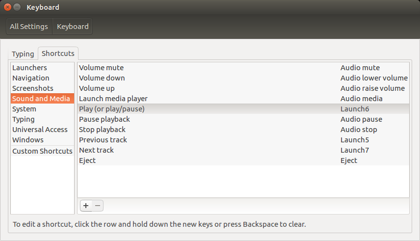

# Footpedals
Here is a list of pedals known to work with Parlatype. If you have a footpedal that is missing but you have been able to set up and work successfully in Parlatype, please add to this section. Thank you!

  * 05f3:00ff PI Engineering, Inc. VEC Footpedal (Infinity IN-USB-2)

## 05f3:00ff PI Engineering, Inc. VEC Footpedal (Infinity IN-USB-2)
The _Infinity IN-USB-2_ is a very sturdy, industrial-quality, 3-pedal device. It can be purchased (amongst other places) on Amazon.

### Parlatype Installation
Ensure that you have Parlatype installed as per your ususal installation procedure. The following instructions have been tested with `Ubuntu 16.04 LTS`, but should also work with other Linux distributions.

### Create UDEV Rule
For this footpedal to be used as a "keyboard" you will need a `udev` rule:

Create the following file: `/etc/udev/rules.d/10-vec-usb-footpedal.rules` with this content:

```
ACTION=="add|change", KERNEL=="event[0-9]*", ATTRS{idVendor}=="05f3", ATTRS{idProduct}=="00ff", ENV{ID_INPUT_KEYBOARD}="1"
```

### Create HWDB File
It's arguably a good idea to use keys which are usually unused. We will map these keys here which will then become available to map later on.

Create the following file: `/etc/udev/hwdb.d/90-custom-keyboard.hwdb` with this content:

```
#Bus 001 Device 002: ID 05f3:00ff PI Engineering, Inc. VEC Footpedal
#Input device ID: bus 0x3 vendor 0x5f3 product 0xff version 0x100
#Input device name: "VEC  VEC USB Footpedal"
evdev:input:b*v05F3p00FF*
 KEYBOARD_KEY_90001=f13
 KEYBOARD_KEY_90002=f14
 KEYBOARD_KEY_90003=f15
```

You are free to map to whichever keys you'd like of course. The above is only a suggestion. Obviously, you shouldn't try to map keys which already have a function.

It might be a good idea to reboot at this point before continuing to the next step.

### Ubuntu (GNOME) Keyboard Settings
After rebooting, open Ubuntu's `Keyboard Settings` (either search for keyboard using Ubuntu's dash, or go to System Settings > Keyboard), and from there do the following:

1. Click on the "Shortcuts" tab.
2. From the list on the left, choose `Sound and Media`.
3. On the list to the right, click on "Play (or play/pause)" and step on the middle pedal of the footpedal. You should see the label change to "Launch6".
4. On the same list, further down, click on "Previous track" and step on the left pedal of the footpedal. You should see the label change to "Launch5".
5. On the same list, click on "Next track" and step on the right pedal of the footpedal. You should see the label change to "Launch7".

Your keyboard settings should something like this:


That's it! Parlatype should use those media keys by default, and you should be ready to go.
