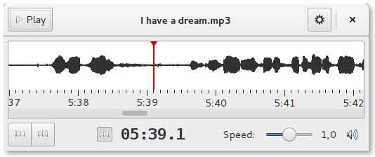

Parlatype is a minimal audio player for manual speech transcription, written for the GNOME desktop environment. It plays audio sources to transcribe them in your favourite text application.

It's intended to be useful for journalists, students, scientists and whoever needs to transcribe audio files.

Parlatype is free and open source software. Please consider a [donation](donate.md), if you like it.

## Credits

- The idea and initial design of Parlatype is based on Frederik Elwert’s program *transcribe*.
- The display of the audio wave form started with code from *Buzztrax*.
- The icon is based on work from the GNOME team.
- Many thanks to all the translators at Launchpad, bug reporters and contributors at Github!
- Ross Gammon sponsored the package in Debian.
- gllmhyt packaged it in Arch Linux.
- Julian Richen helped getting it into Flathub.
- Michael Vetter brought it to openSUSE.
- devhell contributed footpedal documentation.
- Joey Sneddon [reviewed Parlatype](https://www.omgubuntu.co.uk/2017/06/parlatype-transcribe-audio-app-linux).
